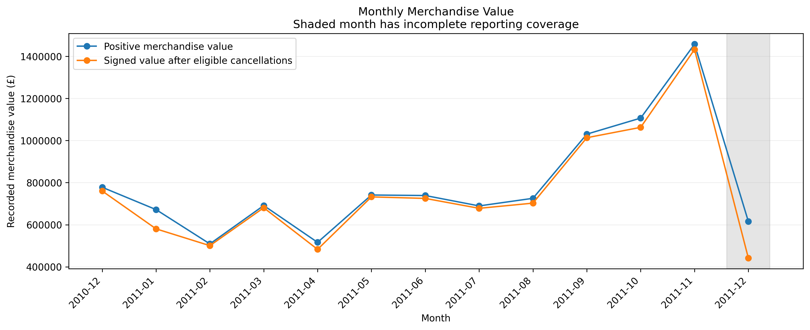
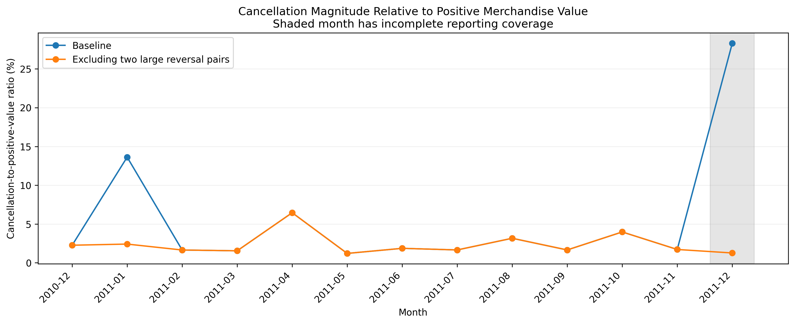

# Online Retail EDA
## Sales Patterns, Customer Behavior, and Cancellations

**Author:** Toya Coleman  
**Tools:** Python, Pandas, NumPy, Matplotlib, Google Colab

## Project purpose

Explore historical online retail transactions to assess data quality, investigate merchandise and purchasing patterns, and identify business questions requiring further investigation.

The intended stakeholder is a hypothetical e-commerce operations or commercial manager. Recommendations address reporting quality, customer review, geographic concentration, and planning.

## Start here

- [EDA notebook](notebooks/Online_Retail_EDA.ipynb)
- [Project workbook](docs/Online%20Retail%20EDA%20-%20Project%20Workbook.pdf)
- [Analysis tracker](docs/Online%20Retail%20EDA%20-%20Analysis%20Tracker.xlsx)

## Data and approach

The source contains 541,909 invoice-line records and eight columns from a UK online retailer, covering December 1, 2010–December 9, 2011.

The analysis preserves original records and creates explicit flags and eligibility rules. Merchandise candidates are separated from special entries and unresolved codes. Positive merchandise entries and eligible cancellations are analyzed separately.

Seven analyses cover:

1. Baseline merchandise values and distributions.
2. Sensitivity to repeated records and large reversals.
3. Monthly patterns and incomplete reporting coverage.
4. Product contributions and ranking sensitivity.
5. Country contributions.
6. Observed repeat purchasing and customer concentration.
7. Cancellation-value sensitivity.

## Key findings

### Reporting choices affect interpretation

Two large cancellation entries account for **51.31%** of eligible merchandise cancellation magnitude. Excluding their matching positive and cancellation entries changes the cancellation-to-positive-value ratio from **4.66% to 2.32%**, while leaving signed merchandise value unchanged.

A separate picnic-basket investigation found that excluding one £38,970 line changes its product-code rank from **9th to 168th**. Its differing descriptions and prices require business verification.

### Repeat purchasers contribute most identified customer-cohort value

Observed repeat purchasers represent **65.27%** of identified purchasing customers and contribute **93.50%** of cohort signed merchandise value.

Customer IDs cover **85.30%** of positive merchandise value. These findings do not measure retention or campaign effectiveness.

### Merchandise value is geographically concentrated

The UK contributes **84.77%** of overall signed merchandise value. Netherlands and EIRE lead outside the UK.

Country totals and identified customer counts require further investigation before making expansion recommendations.

### Late-year activity increased

November 2011 was the strongest complete month, with **£1,432,734.99** in signed merchandise value. December 2011 is incomplete and cannot support a direct full-month decline comparison.

## Selected charts

[View all six charts](figures/)

## Business implications

- Report positive value, cancellation magnitude, and signed value separately.
- Review large transactions, inconsistent product descriptions, and unresolved exceptions.
- Investigate repeat and high-value customer accounts before designing retention tests.
- Examine customer concentration and fulfillment economics before recommending expansion.
- Obtain additional years before assuming recurring seasonality.

These are proposed actions. No implemented business improvement is claimed.

## Limitations

- Historical data from one retailer limits generalizability.
- Missing customer IDs restrict customer-level coverage.
- Exact repetitions remain in baseline analyses; their validity is unconfirmed.
- Merchandise eligibility follows documented analytical rules.
- Product descriptions and prices may be inconsistent.
- Cancellations are not systematically linked to original orders.
- Observed repeat purchasing is not a retention rate.
- Costs and margins are unavailable.
- Recorded merchandise values do not establish profit or recognized revenue.

## Repository structure

| Location | Contents |
|---|---|
| `notebooks/` | Executed Python notebook |
| `figures/` | Six exported charts |
| `summaries/` | Eight aggregate CSV outputs |
| `docs/` | Workbook PDF and analysis tracker |
| `README.md` | Project overview and navigation |

## Reproduce the analysis

1. Download and extract **Online Retail.xlsx** from the source below.
2. Open the notebook in Google Colab.
3. Run cells in order and upload the Excel file when prompted.
4. Review the outputs and final validation messages.

Notebook code documents processing changes. The original dataset is obtained from its source rather than bundled in this repository.

## Dataset attribution

**Dataset:** Online Retail  
**Creator:** Daqing Chen  
**Provider:** UCI Machine Learning Repository  
**Dataset license:** Creative Commons Attribution 4.0 International (CC BY 4.0)

[Dataset source](https://archive.ics.uci.edu/dataset/352/online+retail)

Chen, D. (2015). *Online Retail* [Dataset]. UCI Machine Learning Repository. https://doi.org/10.24432/C5BW33
